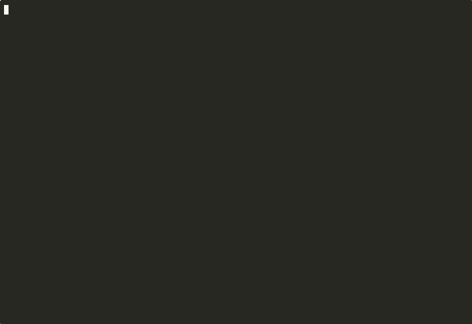

# xydacshell

An opinionated terminal setup. Two profiles, one managed toolchain, safe to re-run.



- **classic** — oh-my-zsh with the `materialshell-electro` theme, amix/vimrc, and a handful of zsh plugins. The original xydacshell stack.
- **modern** — starship prompt, Neovim with a small `init.lua`, and graceful use of fzf / zoxide / lsd / bat / ncdu / dust / duf when they're installed.

Existing users: your setup still works. You stay on `classic` until you opt into `modern`.

## Install

```bash
git clone --recurse-submodules https://github.com/xydac/xydacshell.git ~/.xydacshell
cd ~/.xydacshell
bash install.sh                       # fresh: defaults to modern
bash install.sh --profile classic     # legacy oh-my-zsh stack
```

### Upgrading from a pre-2026 install

Existing classic-profile installs keep working after a `git pull`. The updated
dispatcher defaults to classic when no profile file is present, so your shell
stays byte-for-byte the same. The only visible change is that the `x` command
appears on your `PATH` in new shells.

```bash
cd ~/.xydacshell
bash adopt.sh                                                                     # safe-guards any edits you made to tracked files
git pull --rebase --autostash && git submodule update --init --recursive && exec zsh
x doctor                                                                          # cleanup + offer switch to modern
```

- `adopt.sh` moves any hand-edits you've made to `zshrc.file` / `vimrc.file` into your `zshrc.custom` / `vimrc.custom`, then resets the tracked files. No-op on a clean repo.
- `x doctor` detects common dirty states (submodule untracked content, leftover dispatcher edits) and offers to auto-heal each, then offers the profile switch.
- On classic, say no and nothing changes. From then on, `x update` handles future pulls in one step.

The installer is idempotent — running it twice is safe. After it finishes, open a new shell. The `x` command (and its `xydacshell` alias) is on your `PATH`.

> **Heads-up on the name `x`:** the installer warns you if another `x` command already exists on your PATH (or via shell alias). Our `x` will take precedence in new shells. If you'd rather keep your existing `x`, use the `xydacshell` symlink instead — it's the same command.

## Usage

Once installed, everything runs through the `x` command (`xydacshell` is an alias):

```bash
x                          # help
x install [--profile X]    # run the installer (same as bash install.sh)
x update                   # git pull + submodule sync + reinstall
x switch modern            # flip profile
x doctor                   # diagnose current install state
x rollback                 # restore from the most recent backup
x storage                  # disk-usage report, per-cache cleanup prompts
x uninstall                # remove cleanly, restore legacy backups
```

Every command supports `--dry-run` and `--force`.

## Storage analytics

```bash
x storage                  # filesystems + $HOME top dirs + pkg caches
x storage --caches         # only package-manager caches
x storage --top 20         # more $HOME entries
x storage --clean          # after the report, prompt per-cache to prune
```

The report covers:
- local filesystems (via `duf` if installed, else `df -h`)
- top directories in `$HOME` (via `dust` if installed, else `du | sort`)
- package-manager caches: brew · npm · pnpm · cargo · pip · uv
- docker (`docker system df`)
- trash

Clean-up runs the documented cleanup command for each cache (e.g. `brew cleanup -s`, `pnpm store prune`, `docker system prune -f`), guarded by per-cache y/n prompts. `--dry-run` previews.

## Customize

Edit these files — they outlive any profile switch or upgrade and are never touched by the installer.

- zsh: `~/.xydacshell/zshrc.custom`
- vim (classic): `~/.xydacshell/vimrc.custom`
- nvim (modern): `~/.xydacshell/nvim.custom.lua`

## Modern profile — optional tool install

The installer detects your OS + package manager and offers to install each missing tool, one at a time. Missing tools degrade gracefully — the modern profile still works without them.

```bash
# What the installer offers on macOS:
brew install starship neovim fzf zoxide lsd bat ncdu dust duf

# On Debian/Ubuntu the installer falls back to official scripts for
# tools apt doesn't ship (starship, zoxide, dust).
```

## Uninstall

```bash
x uninstall        # removes our symlinks, restores legacy backups
rm -rf ~/.xydacshell        # removes the repo itself
```

## Repository layout

```
xydacshell/
├── bin/x                                # dispatcher on your PATH
├── bin/xydacshell                       # symlink → x
├── install.sh                           # idempotent, profile-aware
├── lib/
│   ├── util.sh                          # shared shell helpers
│   ├── modern-tools.sh                  # OS + PM detection, tool installer
│   └── cmds/                            # one file per `xydacshell <verb>`
├── profiles/
│   ├── classic/ { zshrc, vimrc }        # the original setup
│   └── modern/  { zshrc, starship.toml, nvim/init.lua }
├── zshrc.file, vimrc.file               # dispatchers (read the profile, load config)
├── materialshell-electro.zsh-theme      # classic prompt theme
├── backup/                              # timestamped backups per install run
└── .github/workflows/ci.yml             # shellcheck + zsh/nvim syntax checks
```

## Compatibility

- `zsh` required.
- `git` required.
- `classic` profile: submodules are used (oh-my-zsh, amix/vimrc, etc.).
- `modern` profile: Neovim recommended; starship, fzf, zoxide, lsd, bat are optional with fallbacks.

## License

MIT. Pull requests welcome.
